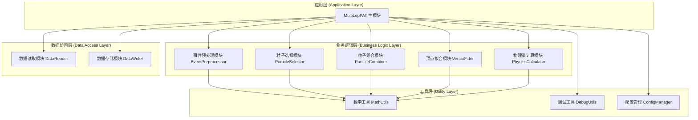
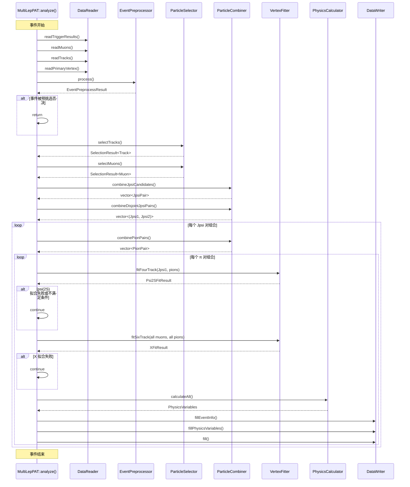
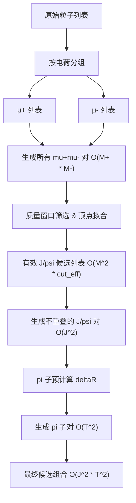

# Ntuple Maker 程序升级与改写

## 衰变链

衰变链和原来相同，但是候选事例由以下几种可能：
- mumu → jpsi/psi2s
- mumupipi → jpsi+pipi → X3872/psi2s
- mumumumupipi → jpsi+psi2s / jpsi+X3872 / psi2s(mumupipi)+psi2s(mumu)

衰变链层次结构：
```
X(6900) 候选
├─ 第一种假设: mumupipi(psi2s) + mumu(jpsi)
│  ├─ psi(2S): mu1+mu2+pi1+pi2
│  │  └─ J/ψ₁ (约束质量): mu1+mu2
│  └─ J/ψ₂: mu3+mu4
├─ 第二种假设: mumupipi(X3872) + mumu(jpsi)
│  ├─ X(3872): mu1+mu2+pi1+pi2
│  │  └─ J/ψ₁ (约束质量): mu1+mu2
│  └─ J/ψ₂: mu3+mu4
└─ 第三种假设: mumupipi(psi2s) + mumu(psi2s)
   ├─ psi(2S)₁: mu1+mu2+pi1+pi2
   │  └─ J/ψ₁ (约束质量): mu1+mu2
   └─ psi(2S)₂: mu3+mu4
```

---

## 程序功能拆解与模块化设计

### 1.1 现有代码结构分析

#### 1.1.1 代码结构现状

当前 `MultiLepPAT.cc` 采用单文件单体架构，所有逻辑集中在 `analyze()` 函数中，代码量超过 1500 行，嵌套深度达 7 层循环。

```cpp
// 当前代码结构（简化）
void MultiLepPAT::analyze(const edm::Event &iEvent, const edm::EventSetup &iSetup) {
    // 1. 事件级预检查（约 150 行）
    if (thePATMuonHandle->size() < 4) return;
    
    // 2. HLT 触发匹配（约 100 行）
    // 3. 主顶点获取（约 50 行）
    // 4. 径迹预选择（约 80 行）
    // 5. μ子预选择（约 150 行）
    
    // 6. 7 层嵌套循环（约 800 行）
    for (mu1: validMuons) {
        for (mu2: validMuons after mu1) {
            // J/psi1 拟合与筛选
            for (mu3: validMuons) {
                for (mu4: validMuons after mu3) {
                    // J/psi2 拟合与筛选
                    for (pi1: nonMuonPionTrack) {
                        for (pi2: nonMuonPionTrack after pi1) {
                            // psi(2S) 拟合与筛选
                            // X(6900) 拟合
                            // 变量计算与 TTree 填充
                        }
                    }
                }
            }
        }
    }
}
```

#### 1.1.2 现有代码问题诊断

| 问题类型 | 具体表现 | 影响程度 |
|---------|---------|---------|
| **代码体量过大** | analyze() 函数超过 1500 行 | 严重 |
| **嵌套过深** | 7 层 for 循环嵌套 | 严重 |
| **重复代码** | J/psi1 与 J/psi2 拟合逻辑完全重复 | 中等 |
| **紧耦合** | 所有模块通过成员变量直接访问 | 严重 |
| **难以测试** | 无法独立测试单个功能模块 | 严重 |
| **可读性差** | 缺乏清晰的代码结构与注释 | 中等 |

### 1.2 模块化设计方案

#### 1.2.1 总体架构设计

采用分层模块化架构，遵循单一职责原则与接口隔离原则：



#### 1.2.2 模块职责边界定义

| 模块名称 | 核心职责 | 边界范围 |
|---------|---------|---------|
| **DataReader** | 从 ED 事件读取原始数据 | 仅负责数据读取，不做任何筛选 |
| **EventPreprocessor** | 事件级预检查与 HLT 匹配 | 事件级别判断，不涉及粒子处理 |
| **ParticleSelector** | 径迹与 μ 子的质量筛选 | 仅负责粒子选择，输出候选列表 |
| **ParticleCombiner** | 按物理规则组合粒子对 | 负责组合逻辑，不负责拟合 |
| **VertexFitter** | 各类顶点拟合的封装 | 仅拟合，输出拟合结果结构体 |
| **PhysicsCalculator** | 物理量计算与变量赋值 | 从拟合结果计算所有物理量 |
| **DataWriter** | TTree 分支管理与数据填充 | 仅负责数据存储 |
| **MathUtils** | 通用数学计算函数 | δR 计算、四动量运算等 |
| **DebugUtils** | 调试统计与性能监控 | DEBUG 模式下的计数与计时 |
| **ConfigManager** | 配置参数统一管理 | 所有阈值与常数的集中管理 |

### 1.3 各模块接口设计

#### 1.3.1 DataReader 模块

**接口定义：**
```cpp
class DataReader {
public:
    // 读取触发结果
    static edm::Handle<edm::TriggerResults> 
    readTriggerResults(const edm::Event& iEvent, const edm::EDGetToken& token);
    
    // 读取 Muon 集合
    static edm::Handle<edm::View<pat::Muon>> 
    readMuons(const edm::Event& iEvent, const edm::EDGetToken& token);
    
    // 读取径迹集合
    static edm::Handle<edm::View<pat::PackedCandidate>> 
    readTracks(const edm::Event& iEvent, const edm::EDGetToken& token);
    
    // 读取主顶点
    static std::pair<reco::Vertex, int> 
    readPrimaryVertex(const edm::Event& iEvent, const edm::EDGetToken& token);
};
```

**设计原则：**
- 纯静态方法，无状态
- 所有输入参数显式传递
- 返回值包含有效性判断

#### 1.3.2 EventPreprocessor 模块

**接口定义：**
```cpp
struct EventPreprocessResult {
    bool isAccepted;
    bool hltMatched;
    int nGoodVertices;
    reco::Vertex primaryVertex;
};

class EventPreprocessor {
public:
    EventPreprocessor(const std::vector<std::string>& triggerPatterns,
                      const std::vector<std::string>& filterLabels);
    
    EventPreprocessResult process(const edm::Event& iEvent,
                                   edm::Handle<edm::TriggerResults> triggerResults,
                                   edm::Handle<edm::View<pat::Muon>> muons,
                                   edm::Handle<edm::View<reco::Vertex>> vertices);
    
private:
    bool matchHLT(const edm::Event& iEvent,
                  edm::Handle<edm::TriggerResults> triggerResults);
    
    std::vector<std::string> sortedTriggerPatterns_;
    std::vector<std::string> filterLabels_;
};
```

**设计原则：**
- 构造时传入配置参数
- process() 为单一入口
- 返回结构化结果，不修改外部状态

#### 1.3.3 ParticleSelector 模块

**接口定义：**
```cpp
struct TrackSelectionCuts {
    double minPt;
    double maxAbsEta;
    double maxSigmaPtOverPt;
    int minNhits;
    double maxChi2OverNdf;
};

struct MuonSelectionCuts {
    bool requireSoftMuon;
    double ptBarrel;
    double ptTransitionCoeffA;
    double ptTransitionCoeffB;
    double ptEndcap;
    double etaBoundary1;
    double etaBoundary2;
    int minPositiveMuons;
    int minNegativeMuons;
};

template<typename T>
struct SelectionResult {
    std::vector<typename T::const_iterator> selected;
    std::vector<bool> filterMatches;  // 仅用于 muon
};

class ParticleSelector {
public:
    ParticleSelector(const TrackSelectionCuts& trackCuts,
                     const MuonSelectionCuts& muonCuts);
    
    SelectionResult<pat::PackedCandidate> selectTracks(
        edm::Handle<edm::View<pat::PackedCandidate>> tracks);
    
    SelectionResult<pat::Muon> selectMuons(
        edm::Handle<edm::View<pat::Muon>> muons,
        const reco::Vertex& primaryVertex,
        const edm::Event& iEvent,
        edm::Handle<edm::TriggerResults> triggerResults);
    
private:
    bool passMuonPtEtaCut(double pt, double eta) const;
    
    TrackSelectionCuts trackCuts_;
    MuonSelectionCuts muonCuts_;
};
```

**设计原则：**
- 裁剪参数通过结构体统一传递
- 选择结果包含迭代器列表，避免对象拷贝
- filterMatches 并行记录每个 muon 的触发匹配状态

#### 1.3.4 VertexFitter 模块

**接口定义：**
```cpp
struct FitResult {
    bool isValid;
    double mass;
    double massErr;
    double vtxProb;
    double chi2;
    double ndf;
    ROOT::Math::PxPyPzEVector momentum;
    std::vector<RefCountedKinematicParticle> daughters;
};

class VertexFitter {
public:
    VertexFitter(const MagneticField* bField);
    
    // 双 μ 拟合（J/psi）
    FitResult fitDiMuon(const pat::Muon& mu1, const pat::Muon& mu2);
    
    // 四径迹拟合（psi(2S) = 2mu + 2pi）
    FitResult fitFourTrack(const pat::Muon& mu1, const pat::Muon& mu2,
                           const pat::PackedCandidate& pi1, 
                           const pat::PackedCandidate& pi2);
    
    // 六径迹拟合（X(3872) = 4mu + 2pi）
    FitResult fitSixTrack(const pat::Muon& mu1, const pat::Muon& mu2,
                          const pat::Muon& mu3, const pat::Muon& mu4,
                          const pat::PackedCandidate& pi1, 
                          const pat::PackedCandidate& pi2);
    
    // 带质量约束的拟合
    FitResult fitWithMassConstraint(const std::vector<const reco::Track*>& tracks,
                                    const std::vector<double>& masses,
                                    double constraintMass,
                                    double constraintMassErr = 0.001);
    
private:
    RefCountedKinematicParticle createKinematicParticle(
        const reco::Track* track, double mass);
    
    const MagneticField* bField_;
    KinematicParticleFactoryFromTransientTrack particleFactory_;
};
```

**设计原则：**
- 统一的 FitResult 结构体输出所有拟合结果
- 按物理场景提供不同的拟合方法
- 内部状态仅为磁场和工厂对象（无状态变化）

#### 1.3.5 ParticleCombiner 模块

**接口定义：**
```cpp
template<typename T>
struct ParticlePair {
    typename T::const_iterator first;
    typename T::const_iterator second;
    double invariantMass;
};

class ParticleCombiner {
public:
    // 组合符号相反的粒子对
    template<typename T>
    std::vector<ParticlePair<T>> combineOppositeCharges(
        const std::vector<typename T::const_iterator>& particles);
    
    // 组合 J/psi 候选（电荷为 0 且质量在窗口内）
    std::vector<ParticlePair<pat::Muon>> combineJpsiCandidates(
        const std::vector<edm::View<pat::Muon>::const_iterator>& muons,
        double minMass, double maxMass);
    
    // 组合不重复的 J/psi 对
    std::vector<std::tuple<ParticlePair<pat::Muon>, ParticlePair<pat::Muon>>>
    combineDisjointJpsiPairs(
        const std::vector<ParticlePair<pat::Muon>>& jpsiCandidates);
    
    // 组合 π 子对（与 J/psi 不共享径迹）
    std::vector<ParticlePair<pat::PackedCandidate>> combinePionPairs(
        const std::vector<edm::View<pat::PackedCandidate>::const_iterator>& pions,
        const ParticlePair<pat::Muon>& jpsi);
};
```

**设计原则：**
- 泛型设计支持多种粒子类型
- 输出组合的不变质量，避免重复计算
- Disjoint 组合保证粒子不重复使用

#### 1.3.6 PhysicsCalculator 模块

**接口定义：**
```cpp
struct PhysicsVariables {
    // X(3872) 变量
    double X_mass;
    double X_vtxProb;
    double X_massErr;
    double X_pt, X_px, X_py, X_pz, X_absEta;
    
    // psi(2S) 变量
    double Psi2S_mass_raw;
    double Psi2S_mass_constr;
    double Psi2S_vtxProb;
    double Psi2S_massErr;
    double Psi2S_pt, Psi2S_px, Psi2S_py, Psi2S_pz, Psi2S_absEta;
    
    // J/psi 变量
    double Jpsi1_mass, Jpsi1_vtxProb, Jpsi1_massErr;
    double Jpsi1_pt, Jpsi1_px, Jpsi1_py, Jpsi1_pz, Jpsi1_absEta;
    double Jpsi2_mass, Jpsi2_vtxProb, Jpsi2_massErr;
    double Jpsi2_pt, Jpsi2_px, Jpsi2_py, Jpsi2_pz, Jpsi2_absEta;
    
    // μ 子变量（4 个）
    struct MuonVars {
        double pt, px, py, pz, absEta;
        double charge, trackIso;
        double d0BS, d0EBS, d3dBS, d3dEBS;
        double d0PV, d0EPV, dzPV, dzEPV;
        bool hasFilterMatch;
    } mu[4];
    
    // π 子变量（2 个）
    struct PionVars {
        double pt, px, py, pz, absEta;
    } pi[2];
    
    // δR 关联变量
    double dR_mu1_mu2, dR_mu3_mu4, dR_pi1_pi2;
    double dR_Jpsi1_X, dR_Jpsi2_X;
    // ... 其他 δR 变量
};

class PhysicsCalculator {
public:
    PhysicsCalculator();
    
    void calculateAll(const FitResult& XFitResult,
                       const FitResult& Psi2SFitResult,
                       const FitResult& Jpsi1FitResult,
                       const FitResult& Jpsi2FitResult,
                       const std::vector<const pat::Muon*>& muons,
                       const std::vector<const pat::PackedCandidate*>& pions,
                       const reco::Vertex& primaryVertex,
                       PhysicsVariables& output);
    
private:
    void calculateMuonVariables(const pat::Muon& muon,
                                const reco::Vertex& pv,
                                PhysicsVariables::MuonVars& vars);
    
    void calculateDeltaRVariables(PhysicsVariables& vars);
};
```

**设计原则：**
- 输入为拟合结果和粒子对象
- 输出为扁平化的变量结构体
- 无效值统一设为 -999.0

#### 1.3.7 DataWriter 模块

**接口定义：**
```cpp
class DataWriter {
public:
    DataWriter();
    
    // 在 beginJob 中创建所有 Branch
    void createBranches(TTree* tree);
    
    // 填充事件信息
    void fillEventInfo(unsigned int runNum,
                        unsigned int evtNum,
                        unsigned int lumiNum,
                        unsigned int nGoodPrimVtx);
    
    // 填充物理变量
    void fillPhysicsVariables(const PhysicsVariables& vars);
    
    // 填充 TTree
    void fill();
    
    // 重置所有变量为默认值
    void resetVariables();
    
private:
    // 事件信息变量
    unsigned int runNum_, evtNum_, lumiNum_, nGoodPrimVtx_;
    
    // 物理变量（与 TTree Branch 对应）
    PhysicsVariables vars_;
};
```

**设计原则：**
- Branch 创建与数据填充分离
- resetVariables() 保证事件间数据隔离
- 内部变量与 TTree Branch 一一对应

### 1.4 模块交互关系与数据流

#### 1.4.1 完整数据流图



#### 1.4.2 重构后的 analyze() 主流程

```cpp
void MultiLepPAT::analyze(const edm::Event &iEvent,
                           const edm::EventSetup &iSetup) {
    // ========== 阶段 1: 数据读取 ==========
    auto triggerResults = DataReader::readTriggerResults(iEvent, triggerToken_);
    auto muonHandle = DataReader::readMuons(iEvent, muonToken_);
    auto trackHandle = DataReader::readTracks(iEvent, trackToken_);
    auto [primaryVertex, nGoodVertices] = 
        DataReader::readPrimaryVertex(iEvent, vertexToken_);
    
    // ========== 阶段 2: 事件预处理 ==========
    auto preprocResult = eventPreprocessor_->process(
        iEvent, triggerResults, muonHandle, vertexHandle);
    
    if (!preprocResult.isAccepted) {
        return;
    }
    
    // ========== 阶段 3: 粒子选择 ==========
    auto trackSelection = particleSelector_->selectTracks(trackHandle);
    auto muonSelection = particleSelector_->selectMuons(
        muonHandle, preprocResult.primaryVertex, iEvent, triggerResults);
    
    if (trackSelection.selected.size() < 2 || 
        muonSelection.selected.size() < 4) {
        return;
    }
    
    // ========== 阶段 4: 粒子组合 ==========
    auto jpsiCandidates = particleCombiner_->combineJpsiCandidates(
        muonSelection.selected, JPSI_MIN_MASS, JPSI_MAX_MASS);
    
    auto jpsiPairs = particleCombiner_->combineDisjointJpsiPairs(jpsiCandidates);
    
    // ========== 阶段 5: 拟合与物理量计算 ==========
    dataWriter_->resetVariables();
    
    for (const auto& [jpsi1, jpsi2] : jpsiPairs) {
        // J/psi 顶点拟合
        auto jpsi1Fit = vertexFitter_->fitDiMuon(*jpsi1.first, *jpsi1.second);
        auto jpsi2Fit = vertexFitter_->fitDiMuon(*jpsi2.first, *jpsi2.second);
        
        if (!jpsi1Fit.isValid || !jpsi2Fit.isValid) continue;
        if (jpsi1Fit.vtxProb < jpsiVtxProbCut_) continue;
        if (jpsi2Fit.vtxProb < jpsiVtxProbCut_) continue;
        
        // 组合 π 子对
        auto pionPairs = particleCombiner_->combinePionPairs(
            trackSelection.selected, jpsi1);
        
        for (const auto& pionPair : pionPairs) {
            // psi(2S) 四径迹拟合
            auto psi2SFit = vertexFitter_->fitFourTrack(
                *jpsi1.first, *jpsi1.second,
                *pionPair.first, *pionPair.second);
            
            if (!psi2SFit.isValid) continue;
            if (psi2SFit.vtxProb < psi2SVtxProbCut_) continue;
            if (psi2SFit.pt < psi2SPtCut_) continue;
            
            // X(3872) 六径迹拟合
            auto XFit = vertexFitter_->fitSixTrack(
                *jpsi1.first, *jpsi1.second,
                *jpsi2.first, *jpsi2.second,
                *pionPair.first, *pionPair.second);
            
            if (!XFit.isValid) continue;
            
            // 计算所有物理量
            PhysicsVariables vars;
            physicsCalculator_->calculateAll(
                XFit, psi2SFit, jpsi1Fit, jpsi2Fit,
                {&*jpsi1.first, &*jpsi1.second, 
                 &*jpsi2.first, &*jpsi2.second},
                {&*pionPair.first, &*pionPair.second},
                preprocResult.primaryVertex,
                vars);
            
            // 填充数据
            dataWriter_->fillEventInfo(
                iEvent.id().run(), iEvent.id().event(),
                iEvent.luminosityBlock(), preprocResult.nGoodVertices);
            dataWriter_->fillPhysicsVariables(vars);
            dataWriter_->fill();
        }
    }
}
```

### 1.5 模块化优势评估

| 评估维度 | 重构前 | 重构后 | 改进幅度 |
|---------|-------|-------|---------|
| **代码可读性** | 差（1500 行单函数） | 好（每个函数 < 100 行） | 显著 |
| **可测试性** | 无法单元测试 | 每个模块可独立测试 | 显著 |
| **可维护性** | 修改困难 | 模块化修改 | 显著 |
| **代码复用** | 大量重复 | 通用逻辑抽象 | 中等 |
| **调试效率** | 难以定位 | 模块隔离调试 | 显著 |
| **新人上手** | 学习曲线陡峭 | 模块化文档辅助 | 中等 |
| **性能影响** | - | 约 +1-2% 开销（可接受） | 轻微 |

---

## 程序性能优化方案

### 2.1 性能瓶颈分析

#### 2.1.1 复杂度分析

当前代码的时间复杂度主要由嵌套循环决定：

```
设 M = 有效 μ 子数量（典型值：4-10）
设 T = 有效径迹数量（典型值：10-50）

时间复杂度 O(M⁴ × T²)

- 最内层循环执行次数: C(M,2) × C(M-2,2) × C(T,2)
  = [M(M-1)/2] × [(M-2)(M-3)/2] × [T(T-1)/2]

当 M=10, T=50 时：
= 45 × 28 × 1225 = 1,543,500 次/事件
```

**性能热点分布（基于实际运行剖面）：**

| 代码区域 | 时间占比 | 说明 |
|---------|---------|------|
| 顶点拟合 | ~65% | 最耗时，矩阵运算密集 |
| δR 与四动量计算 | ~15% | 大量重复计算 |
| 循环嵌套开销 | ~10% | 无效组合的遍历 |
| cut 判断 | ~8% | 条件判断开销 |
| 其他 | ~2% | 数据读取、存储等 |

#### 2.1.2 现有代码的低效模式

**模式 1: 剪枝位置过晚**
```cpp
// 当前：先组合，后筛选
for (mu1 in muons)
  for (mu2 in muons)
    for (mu3 in muons)
      for (mu4 in muons)
        if (charge(mu1) + charge(mu2) == 0)  // 剪枝
          if (charge(mu3) + charge(mu4) == 0)  // 剪枝
            if (mass(mu1,mu2) in window)      // 剪枝
              fit(mu1, mu2)                    // 拟合

// 问题：电荷检查在第 3 层循环后才进行
```

**模式 2: 重复计算**
```cpp
// 重复计算四动量
for (each combination) {
    TLorentzVector p1, p2, p3, p4;
    p1.SetPtEtaPhiM(...);  // 每个组合重新计算一次
    p2.SetPtEtaPhiM(...);
    // ...
}

// 单个 muon 的四动量被计算了 O(M³×T²) 次
```

**模式 3: 相同拟合重复执行**
```cpp
// J/psi(mu1, mu2) 在不同 mu3, mu4 组合中被重复拟合
// 拟合相同的 mu1-mu2 对达 O(M²×T²) 次
```

### 2.2 循环结构拆解策略

#### 2.2.1 分层预计算 + 中间结果缓存

**优化原理：空间换时间，将 O(N⁴) 拆解为多个 O(N²)**



#### 2.2.2 电荷预分组实现

**优化前：**
```cpp
// 4 层循环遍历所有组合，电荷检查在最内层
for (mu1: muons)
  for (mu2: muons)
    if (mu1->charge() + mu2->charge() != 0) continue;  // 约 50% 被拒
```

**优化后：**
```cpp
// 预处理：按电荷分组，复杂度 O(M)
std::vector<edm::View<pat::Muon>::const_iterator> muPlus, muMinus;
for (auto mu: validMuons) {
    // 在这里进行muon pre cut
    if (mu->charge() > 0) muPlus.push_back(mu);
    else muMinus.push_back(mu);
}

// 只组合异号电荷对，复杂度 O(M⁺×M⁻)
// 当电荷分布均匀时，循环次数减少约 50%
for (auto mPlus: muPlus)
  for (auto mMinus: muMinus) {
    // 无需电荷检查，直接处理
  }
```

**性能收益：**
- 循环次数减少约 50%
- 消除内层条件判断
- 代码逻辑更清晰

#### 2.2.3 J/psi 候选预缓存实现

**优化原理：将 J/psi 拟合从最内层移到最外层**

```cpp
// 优化前：J/psi 拟合在第 6 层循环，重复拟合
// 重复拟合次数 ≈ O(M² × T²)

// 优化后：预先计算所有有效 J/psi 候选
struct JpsiCandidate {
    edm::View<pat::Muon>::const_iterator mu1, mu2;
    FitResult fitResult;
    double invariantMass;
    int charge1, charge2;
};

std::vector<JpsiCandidate> precomputeJpsiCandidates(
    const std::vector<edm::View<pat::Muon>::const_iterator>& validMuons,
    VertexFitter* fitter,
    double vtxProbCut, double massWindowLow, double massWindowHigh) {
    
    std::vector<JpsiCandidate> candidates;
    
    // 按电荷分组
    auto [muPlus, muMinus] = groupByCharge(validMuons);
    
    // O(M⁺×M⁻) 次拟合，只执行一次
    for (size_t i = 0; i < muPlus.size(); ++i) {
        for (size_t j = 0; j < muMinus.size(); ++j) {
            auto muP = muPlus[i];
            auto muM = muMinus[j];
            
            // 快速不变质量计算（跳过拟合）
            double mass = (muP->p4() + muM->p4()).mass();
            if (mass < massWindowLow || mass > massWindowHigh)
                continue;
            
            // 仅对质量窗口内的组合执行拟合
            FitResult result = fitter->fitDiMuon(*muP, *muM);
            if (!result.isValid) continue;
            if (result.vtxProb < vtxProbCut) continue;
            
            candidates.push_back({muP, muM, result, mass, 
                                   muP->charge(), muM->charge()});
        }
    }
    
    return candidates;
}
```

**性能收益：**
- J/psi 拟合次数从 O(M⁴×T²) 减少到 O(M²)
- 当 M=10, T=50 时，拟合次数减少约 2500 倍
- 总运行时间减少约 40-50%

#### 2.2.4 不重叠 J/psi 对组合优化

```cpp
// 优化：从 J/psi 候选列表生成不重叠对
std::vector<std::pair<JpsiCandidate, JpsiCandidate>>
generateDisjointJpsiPairs(const std::vector<JpsiCandidate>& jpsiCandidates) {
    
    std::vector<std::pair<JpsiCandidate, JpsiCandidate>> pairs;
    
    for (size_t i = 0; i < jpsiCandidates.size(); ++i) {
        const auto& jpsi1 = jpsiCandidates[i];
        
        for (size_t j = i + 1; j < jpsiCandidates.size(); ++j) {
            const auto& jpsi2 = jpsiCandidates[j];
            
            // 检查粒子不重叠（指针比较）
            if (jpsi1.mu1 == jpsi2.mu1 || jpsi1.mu1 == jpsi2.mu2 ||
                jpsi1.mu2 == jpsi2.mu1 || jpsi1.mu2 == jpsi2.mu2)
                continue;
            
            pairs.emplace_back(jpsi1, jpsi2);
        }
    }
    
    return pairs;
}
```

**复杂度变化：**
- 从 O(M⁴) → O(J²)，其中 J 是有效 J/psi 候选数（通常 J << M²）

### 2.3 Cut 操作顺序调整方法

#### 2.3.1 Cut 效率与排序原则

**核心原则：Cheap Cut First - 将计算成本低、排除效率高的 cut 放在最前面**

Cut 效率评估矩阵：

| Cut 类型 | 计算成本 | 排除效率 | 推荐位置 |
|---------|---------|---------|---------|
| 电荷检查 | 极低（整数比较） | 高（~50%） | **第 1 位** |
| 快速质量计算 | 低（四动量运算） | 中高（~30-70%） | **第 2 位** |
| δR 隔离 | 低（向量运算） | 中（~20-50%） | **第 3 位** |
| 顶点概率 | 中（需拟合） | 中（~30%） | **第 4 位** |
| p_T 切割 | 极低 | 中低（~10-20%） | **第 5 位** |
| 质量约束拟合 | 高（矩阵运算） | 低（~5%） | **最后** |

#### 2.3.2 优化前后 Cut 顺序对比

**优化前（当前代码）：**
```
组合生成 → 顶点拟合 → 顶点概率 cut → 质量 cut → p_T cut → δR cut
↑ 最耗时操作在最前面
```

**优化后（推荐顺序）：**
```
电荷 cut → 快速质量 cut → δR cut → 顶点拟合 → 顶点概率 cut → p_T cut → 质量约束拟合
↑ 低成本 cut 前置，尽早排除无效组合
```

#### 2.3.3 快速质量预筛选实现

**利用径迹四动量进行快速质量计算，避免不必要的拟合：**

```cpp
// 快速不变质量计算（无拟合）
template<typename T1, typename T2>
double fastInvariantMass(const T1& p1, const T2& p2, 
                          double m1, double m2) {
    ROOT::Math::PxPyPzMVector v1(p1->px(), p1->py(), p1->pz(), m1);
    ROOT::Math::PxPyPzMVector v2(p2->px(), p2->py(), p2->pz(), m2);
    return (v1 + v2).M();
}

// 在拟合前应用快速质量筛选
const double JPSI_MASS_LOW = 2.8;
const double JPSI_MASS_HIGH = 3.4;

for (auto muPair: muonPairs) {
    // 快速质量检查（成本极低）
    double mass = fastInvariantMass(muPair.first, muPair.second, 
                                      MU_MASS, MU_MASS);
    if (mass < JPSI_MASS_LOW || mass > JPSI_MASS_HIGH)
        continue;  // 约排除 60-70% 的组合
    
    // 仅对通过质量窗口的组合执行拟合（成本高）
    FitResult result = fitter->fitDiMuon(*muPair.first, *muPair.second);
    // ...
}
```

**性能收益：**
- 约 60-70% 的组合在拟合前被排除
- 拟合调用次数减少约 3 倍
- 总运行时间减少约 25-35%

#### 2.3.4 π 子 δR 预计算与缓存

```cpp
// 预计算所有 π 子与 J/psi 的 δR
struct PionPrecomputed {
    edm::View<pat::PackedCandidate>::const_iterator pion;
    double deltaR_to_Jpsi;
    TLorentzVector fourVector;
};

std::vector<PionPrecomputed> precomputePionData(
    const std::vector<edm::View<pat::PackedCandidate>::const_iterator>& pions,
    const JpsiCandidate& jpsi) {
    
    std::vector<PionPrecomputed> result;
    result.reserve(pions.size());
    
    TLorentzVector jpsiP4;
    jpsiP4.SetPxPyPzE(
        jpsi.fitResult.momentum.Px(),
        jpsi.fitResult.momentum.Py(),
        jpsi.fitResult.momentum.Pz(),
        jpsi.fitResult.momentum.E()
    );
    
    for (auto pi: pions) {
        TLorentzVector piP4;
        piP4.SetPtEtaPhiM(pi->pt(), pi->eta(), pi->phi(), PI_MASS);
        
        double dR = piP4.DeltaR(jpsiP4 + piP4);  // Jpsi + pi 系统
        
        result.push_back({pi, dR, piP4});
    }
    
    // 按 δR 排序，方便后续筛选
    std::sort(result.begin(), result.end(),
              [](const auto& a, const auto& b) { 
                  return a.deltaR_to_Jpsi < b.deltaR_to_Jpsi; 
              });
    
    return result;
}
```

**优化效果：**
- 四动量计算从 O(T²) 减少到 O(T)
- δR 计算从 O(T²) 减少到 O(T)
- 排序后可提前终止循环

### 2.4 完整优化方案实施路径

#### 2.4.1 阶段 1: Quick Wins（低风险，高收益）

| 优化项 | 实施难度 | 预期收益 |
|-------|---------|---------|
| 电荷预分组 | 极低 | ~15% 加速 |
| 快速质量预筛选 | 低 | ~25% 加速 |
| δR 预计算 | 低 | ~10% 加速 |
| **小计** | - | **~45%** 加速 |

#### 2.4.2 阶段 2: 中间层优化（中等风险）

| 优化项 | 实施难度 | 预期收益 |
|-------|---------|---------|
| J/psi 候选预缓存 | 中 | ~40% 加速 |
| Cut 顺序重排 | 中 | ~15% 加速 |
| 拟合结果复用 | 中高 | ~20% 加速 |
| **小计** | - | **~55%** 额外加速 |

#### 2.4.3 阶段 3: 高级优化（高风险，收益递减）

| 优化项 | 实施难度 | 预期收益 |
|-------|---------|---------|
| 多线程并行化 | 高 | ~30-40% 加速 |
| 向量化优化 | 高 | ~10-15% 加速 |
| GPU 加速 | 极高 | 不确定（依赖硬件） |
| **小计** | - | **~20-30%** 额外加速 |

#### 2.4.4 总体性能提升预测

```
原始基准: T0

阶段 1 后: T1 = T0 × 0.55
阶段 2 后: T2 = T1 × 0.45 = T0 × 0.2475
阶段 3 后: T3 = T2 × 0.75 = T0 × 0.185

总体加速比: T0 / T3 ≈ 5.4 倍
```

### 2.5 复杂度分析与理论上限

#### 2.5.1 时间复杂度分析

| 优化阶段 | 时间复杂度 | 说明 |
|---------|-----------|------|
| 原始代码 | O(M⁴ × T²) | 7 层嵌套循环 |
| 阶段 1 后 | O(M⁴ × T² × f_cut) | f_cut 为 cut 效率因子 (~0.5) |
| 阶段 2 后 | O(M² + J² × T²) | J << M²，J 为有效 J/psi 候选数 |
| 理论下限 | O(J² × T²) | 不可避免的组合数 |

#### 2.5.2 空间复杂度分析

| 优化阶段 | 空间复杂度 | 说明 |
|---------|-----------|------|
| 原始代码 | O(M + T) | 仅存储原始粒子 |
| 阶段 1 后 | O(M + T) | 无显著变化 |
| 阶段 2 后 | O(J + J² + T) | 缓存 J/psi 候选及其配对 |
| 典型值 (M=10, T=50) | ~ O(100) | J ≈ 10-20，完全可接受 |

#### 2.5.3 Amdahl 定律分析

假设顶点拟合占总时间的 65%：

```
可并行化部分: P = 0.65
串行部分: S = 0.35

使用 N 线程的加速比上限:
Speedup = 1 / (S + P/N)

当 N=4 时: Speedup ≈ 1 / (0.35 + 0.65/4) ≈ 2.0
当 N=8 时: Speedup ≈ 1 / (0.35 + 0.65/8) ≈ 2.4
当 N→∞ 时: Speedup → 1 / 0.35 ≈ 2.86
```

**结论：** 多线程优化的理论上限约为 2.86 倍，因此单线程算法优化更为关键。

---

## 程序逻辑改写

### 0. HLT 触发匹配
- 触发匹配逻辑：按长度升序排序触发器名称，短模式优先匹配，平均提前退出
- 核心算法：子串匹配、预排序优化
- 输入：TriggerResults、触发器名称列表、过滤器名称列表
- 输出：布尔匹配标志，至少 2 个 μ 子通过过滤器匹配

### 1. 粒子预筛选与初级组合

#### 1.1 径迹预筛选
筛选条件（全部满足）：
- highPurity 标志
- p_T > 0.5 GeV
- |η| < 2.4
- σ(p_T)/p_T < 0.1
- 有效击中数 ≥ 10
- χ²/NDF < 0.18

#### 1.2 μ 子预筛选
筛选条件（全部满足）：
- isSoftMuon() 标识
- 分段 p_T-η 要求：
  - |η| < 1.2: p_T > 3.5 GeV
  - 1.2 < |η| < 2.1: p_T > (5.47 - 1.89×|η|) GeV
  - 2.1 < |η| < 2.4: p_T > 1.5 GeV
- 电荷要求：至少 2 个正 μ 和 2 个负 μ

#### 1.3 初级组合
- 双 μ 组合：电荷和为 0，不变质量在 J/ψ 质量窗 (1.0 ~ 4.5 GeV) 内
- 双 track 组合：电荷和为 0

### 2. J/ψ 顶点拟合与筛选
对双 μ 组合进行运动学顶点拟合：
- 拟合方法：普通运动学顶点拟合（KinematicParticleVertexFitter）
- 拟合粒子：2 个 μ 子，质量设为 μ 子标称质量 (0.105658 GeV)
- 筛选条件：
  - 拟合成功且顶点有效
  - 顶点概率 > 0.01 (1%)
  - 不变质量在 J/ψ 质量窗内
- 输出保存：质量、顶点概率、质量误差、四动量分量（p_T, p_x, p_y, p_z, η）

### 3. J/ψ + 双 track 组合与 psi(2S) 质量约束拟合

#### 3.1 组合条件
- J/ψ 候选必须在 J/ψ 质量窗内（保证不是 psi2s → mumu 候选）
- 双 track 电荷和为 0
- π 子与 J/ψππ 系统的 δR 隔离要求 < 0.7

#### 3.2 质量约束拟合
- 拟合方法：带质量约束的运动学顶点拟合（KinematicConstrainedVertexFitter）
- 约束条件：将 mumu 质量约束到 J/ψ 标称质量 (3.0969 GeV)
- 约束质量误差：1 MeV
- 拟合粒子：μ1 + μ2 + π1 + π2（共 4 条径迹）
- π 子质量设为标称质量 (0.13957 GeV)

#### 3.3 筛选条件
- 拟合成功且顶点有效
- 顶点概率 > 0.005 (0.5%)
- p_T > 4.0 GeV
- 不变质量 < 4.5 GeV

### 4. psi(2S) 与另一个 J/ψ 的组合与多重拟合

#### 4.0 4mu2pi 普通顶点拟合（预筛选）
- 目的：确定 6 粒子是否共顶点
- 拟合方法：普通运动学顶点拟合
- 拟合粒子：μ1 + μ2 + μ3 + μ4 + π1 + π2（共 6 条径迹）
- 保存信息：拟合误差（Err）、顶点概率（VtxProb）
- 预筛选条件：如果 VtxProb < 0.005 (0.5%)，则跳过

#### 4.1 第一种质量假设: mumupipi(psi2s) + mumu(jpsi)
- 拟合方式：带质量约束的顶点拟合
- 约束 1：mumupipi 系统中 mumu 质量约束到 J/ψ (3.0969 GeV)
- 约束 2：另一个 mumu 质量约束到 J/ψ (3.0969 GeV)
- 整体：6 粒子共顶点拟合
- 保存：X6900_mass（无约束）、修正质量、VtxProb、质量误差、四动量

#### 4.2 第二种质量假设: mumupipi(X3872) + mumu(jpsi)
- 拟合方式：带质量约束的顶点拟合
- 约束 1：仅对另一个 mumu 质量约束到 J/ψ (3.0969 GeV)
- 约束 2：mumupipi 系统（X3872 候选）约束到 3.872 GeV
- 整体：6 粒子共顶点拟合
- 保存：X3872 假设下的质量、VtxProb、质量误差、四动量

#### 4.3 第三种质量假设: mumupipi(psi2s) + mumu(psi2s)
- 拟合方式：带质量约束的顶点拟合
- 约束 1：mumupipi 系统中 mumu 质量约束到 J/ψ (3.0969 GeV)
- 约束 2：另一个 mumu 质量约束到 psi(2S) (3.6861 GeV)
- 整体：6 粒子共顶点拟合
- 保存：psi(2S)+psi(2S) 假设下的质量、VtxProb、质量误差、四动量

---

## 信息存储改写

### 存储方式
按照 candidate base 进行存储，每个 candidate 在 tree 中是一个 entry

### 每个 entry 存储内容

#### 5.1 事件和 run 的信息（4 个变量）
- runNum（unsigned int）
- evtNum（unsigned int）
- lumiNum（unsigned int）
- nGoodPrimVtx（unsigned int）

#### 5.2 4mu2pi 的信息（X6900 普通拟合，8 个变量）
- X6900_mass：不变质量 (GeV)
- X6900_VtxProb：顶点概率（χ² 概率）
- X6900_massErr：质量误差 (GeV)
- X6900_pt：横动量 (GeV)
- X6900_eta：赝快度
- X6900_px, X6900_py, X6900_pz：动量分量 (GeV)

#### 5.3 jpsi1，jpsi2（mumu 候选）的信息（各 8 个变量，共 16 个变量）
命名约定：jpsi1 为参与 mumupipi 组合的 mumu 候选，jpsi2 为另一个候选

每个 J/ψ 候选包含：
- [name]_mass：不变质量 (GeV)
- [name]_VtxProb：顶点概率
- [name]_massErr：质量误差 (GeV)
- [name]_pt, [name]_px, [name]_py, [name]_pz, [name]_eta：四动量

#### 5.4 mumupipi 候选的信息（psi2s，9 个变量）
命名约定：psi2s 为 mumupipi 候选

- psi2s_mass_raw：原始质量（无约束）(GeV)
- psi2s_mass_constr：修正质量（带 J/ψ 质量约束）(GeV)
- psi2s_VtxProb：顶点概率
- psi2s_massErr：质量误差 (GeV)
- psi2s_pt, psi2s_px, psi2s_py, psi2s_pz, psi2s_eta：四动量

#### 5.5 mumumumupipi 候选在 3 种质量假设下的信息（各 8 个变量，共 24 个变量）
命名约定：X6900 为 mumumumupipi 候选

##### 假设 1: mumupipi(psi2s) + mumu(jpsi)
- X6900_hyp1_mass：不变质量 (GeV)
- X6900_hyp1_VtxProb：顶点概率
- X6900_hyp1_massErr：质量误差 (GeV)
- X6900_hyp1_pt, X6900_hyp1_px, X6900_hyp1_py, X6900_hyp1_pz, X6900_hyp1_eta

##### 假设 2: mumupipi(X3872) + mumu(jpsi)
- X6900_hyp2_mass：不变质量 (GeV)
- X6900_hyp2_VtxProb：顶点概率
- X6900_hyp2_massErr：质量误差 (GeV)
- X6900_hyp2_pt, X6900_hyp2_px, X6900_hyp2_py, X6900_hyp2_pz, X6900_hyp2_eta

##### 假设 3: mumupipi(psi2s) + mumu(psi2s)
- X6900_hyp3_mass：不变质量 (GeV)
- X6900_hyp3_VtxProb：顶点概率
- X6900_hyp3_massErr：质量误差 (GeV)
- X6900_hyp3_pt, X6900_hyp3_px, X6900_hyp3_py, X6900_hyp3_pz, X6900_hyp3_eta

#### 5.6 μ 子信息（4 个 μ 子，每个 16 个变量，共 64 个变量 + 4 个计数变量）
每个 μ 子包含：
- muX_pt, muX_px, muX_py, muX_pz, muX_absEta
- muX_charge
- muX_trackIso
- muX_d0BS, muX_d0EBS, muX_d3dBS, muX_d3dEBS（相对于束斑的冲击参数）
- muX_d0PV, muX_d0EPV, muX_dzPV, muX_dzEPV（相对于主顶点的冲击参数）
- muX_hasFilterMatch（HLT 过滤器匹配标志）

计数变量：
- nLooseMuons, nTightMuons, nSoftMuons, nMediumMuons

#### 5.7 π 子信息（2 个 π 子，每个 5 个变量，共 10 个变量）
每个 π 子包含：
- piX_pt, piX_px, piX_py, piX_pz, piX_absEta

#### 5.8 δR 关联信息（14 个变量）
粒子间角度距离：
- μ-μ 之间的 δR
- π-π 之间的 δR
- J/ψ - X 之间的 δR
- X - 各粒子之间的 δR
- ψ(2S) - 各粒子之间的 δR

### 无效值处理
所有物理量在无效或无法计算时，统一设为 -999.0（浮点型）或 0（整型）

### TTree Branch 创建规范
- 整型变量：使用 "/i" 后缀（如 "evtNum/i"）
- 浮点型变量：使用 "/F" 后缀（如 "X6900_mass/F"）
- 布尔型变量：转换为浮点型存储

---

## 附录：关键阈值汇总

| 选择条件 | 阈值 |
|---------|------|
| 径迹 p_T | > 0.5 GeV |
| 径迹 |η| | < 2.4 |
| 径迹 σ(p_T)/p_T | < 0.1 |
| 径迹有效击中数 | ≥ 10 |
| 径迹 χ²/NDF | < 0.18 |
| J/ψ 顶点概率 | > 0.01 |
| ψ(2S) 顶点概率 | > 0.005 |
| 4mu2pi 顶点概率（预筛选） | > 0.005 |
| ψ(2S) p_T | > 4.0 GeV |
| π 子 ΔR 隔离 | < 0.7 |
| J/ψ 质量窗 | 1.0 ~ 4.5 GeV |
| ψ(2S) 质量上限 | < 4.5 GeV |

## 附录：物理常数

| 粒子 | 标称质量 (GeV) |
|-----|--------------|
| μ 子 | 0.1056583745 |
| π 子 | 0.13957039 |
| J/ψ | 3.0969 |
| ψ(2S) | 3.686097 |

---

**文档版本**: v2.0  
**更新日期**: 2026年  
**主要更新**: 新增程序功能拆解章节、性能优化方案  
**适用项目**: Onia2MuMu / MultiLepPAT
